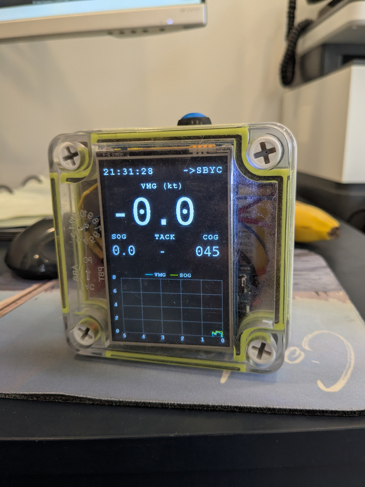

# Speed Cube



## Overview

**Speed Cube** is a high-performance GPS-based navigation and logging system designed for embedded platforms using the Raspberry Pi Pico microcontroller. It features a real-time graphical user interface, web server for remote monitoring, and robust data logging capabilities. The project integrates GPS data acquisition, filtering, and visualization, making it ideal for applications such as vehicle telemetry, outdoor navigation, and speed tracking.

## Purpose

The main goals of Speed Cube are:
- **Accurate GPS Tracking:** Acquire and process real-time GPS data using the L76B module.
- **Data Filtering:** Apply Kalman filtering to improve position and speed accuracy.
- **User Interface:** Display navigation information on an LCD screen with a responsive GUI.
- **Remote Access:** Serve live data and logs via a built-in web server.
- **Data Logging:** Store GPS data in CSV format for later analysis.
- **Button Control:** Provide physical interaction for logging and navigation functions.

## Components

- **Raspberry Pi Pico:** Main microcontroller running all system logic.
- **L76B GPS Module:** Provides raw GPS data.
- **LCD Display:** Visualizes navigation data and system status.
- **Button Input:** Allows user interaction for logging and navigation.
- **Web Server:** Enables remote access to live and logged data (under development).
- **GPS Logger:** Records filtered and raw GPS data to CSV files.
- **Navigation GUI:** Renders speed, heading, and position on the display.
- **Kalman Filter:** Smooths GPS data for improved accuracy.
- **Font Library:** Custom fonts for clear on-screen text.

## Usage

1. **Hardware Setup:** Connect the Pico, L76B GPS module, LCD display, and button according to the wiring diagram.
2. **Build & Flash:** Use CMake and the Pico SDK to build the project, then flash the binary to your Pico.
3. **Operation:** On startup, the system initializes the GPS, LCD, and web server. The LCD displays live navigation data. Press the button to log data or interact with the GUI.
4. **Remote Monitoring:** Connect to the Pico’s web server via Wi-Fi to view live data and download logs.
5. **Data Analysis:** Access CSV logs for post-processing and analysis.

## Directory Structure

```
speed-cube/
├── speed-cube.cpp         # Main application logic
├── lib/
│   ├── L76B/              # GPS module driver
│   ├── LCD/               # LCD display driver
│   ├── font/              # Font resources
│   └── navigation/        # GUI and navigation logic
├── gps_data.h             # Shared GPS data structures
├── gps_logger.h           # Logging utilities
├── config.h               # System configuration
├── docs/
│   └── final-product.jpg  # Photo of the assembled device
└── README.md              # Project documentation
```

## Getting Started

1. **Clone the repository:**
   ```bash
   git clone https://github.com/yourusername/speed-cube.git
   cd speed-cube
   ```
2. **Set up the Pico SDK and toolchain.**
3. **Configure and build:**
   ```bash
   mkdir build
   cd build
   cmake ..
   make
   ```
4. **Flash the binary to your Pico.**
5. **Power up and enjoy real-time GPS navigation and logging!**

## License

This project is open source under the MIT License.

---
